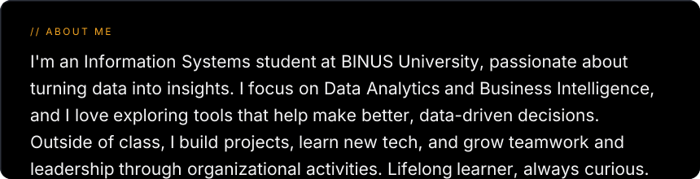
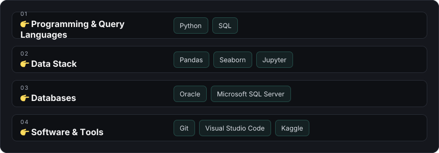

  

  
<b>💻 GitHub Profile Stats</b>

   
  

    
     
    &nbsp;
    
     
    <b>Note:</b> Top languages is a metric of the languages in my public repos and doesn't reflect experience or skill level.
  

  
<b>⚡ Recent GitHub Activity</b>

   
  
   

***

<ul>
  <li>Credit: Template parts adapted from <a href="https://github.com/DenverCoder1">DenverCoder1</a> & <a href="https://github.com/anuraghazra">anuraghazra</a></li>
  <li>Last Edited on: 20/08/2025</li>
</ul>

<!-- Quick blurb for visitors -->

  🌱 Currently learning <b>Data Analytics & Data Science</b> • 📫 Reach me at <b>marvinchandiary@gmail.com</b>

