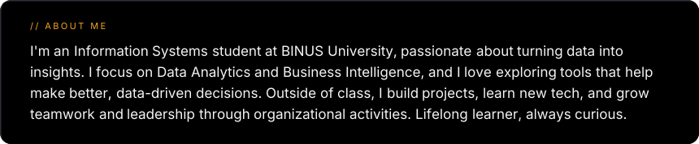
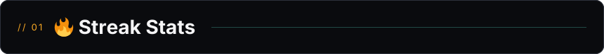
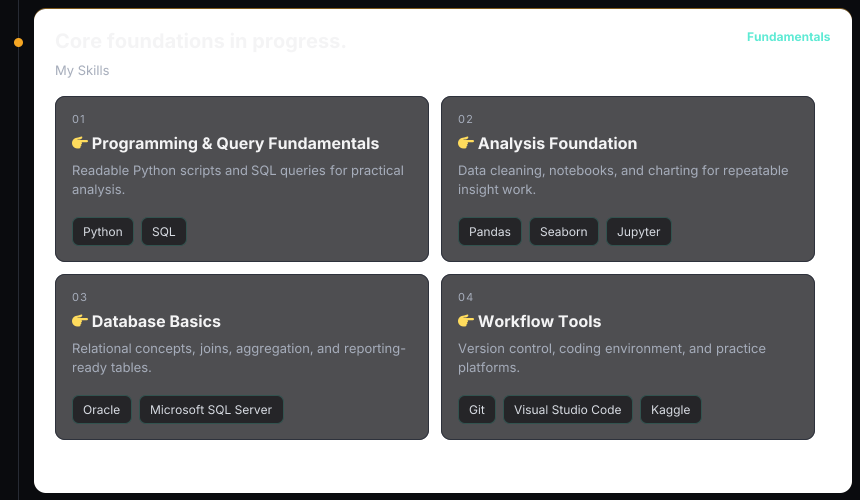
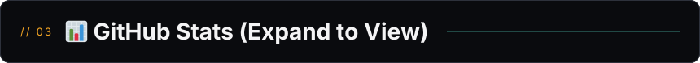
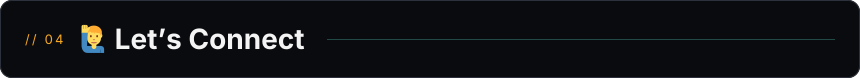

  

  
<b>💻 GitHub Profile Stats</b>

   
  

    
     
    &nbsp;
    
     
    <b>Note:</b> Top languages is a metric of the languages in my public repos and doesn't reflect experience or skill level.
  

  
<b>⚡ Recent GitHub Activity</b>

   
  
   

***

<ul>
  <li>Credit: Design inspired by <a href="https://github.com/collectioneur/readme-aura">collectioneur/readme-aura</a> and <a href="https://github.com/formidablae/formidablae">formidablae/formidablae</a>; template and stats parts adapted from <a href="https://github.com/DenverCoder1">DenverCoder1</a>, <a href="https://github.com/anuraghazra">anuraghazra</a>, and <a href="https://github.com/stats-organization/github-stats-extended">stats-organization/github-stats-extended</a></li>
  <li>Last Edited on: 05/07/2026</li>
</ul>

<!-- Quick blurb for visitors -->

  🌱 Currently learning <b>Data Engineering</b> • 📫 Reach me at <b>marvinchandiary@gmail.com</b>

