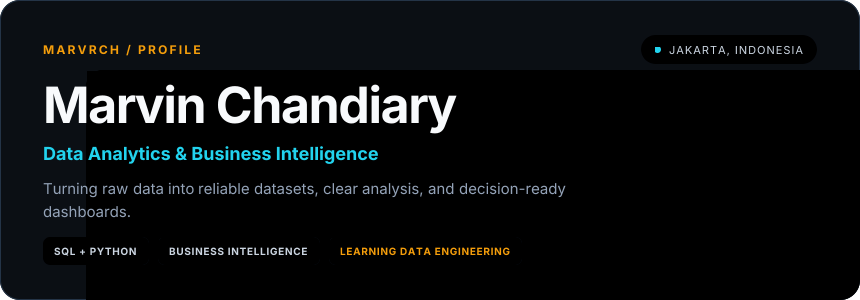

  
  
  
  

Information Systems student at BINUS University · Building at the intersection of data, systems, and business decisions

## About

I enjoy the part of data work where technical detail meets business context: defining useful metrics, cleaning imperfect data, finding the signal, and communicating it clearly. My foundation is in **analytics and BI**, and I am currently expanding toward **data engineering** to build more reliable end-to-end data workflows.

<table>
  <tr>
    <td width="33%" valign="top">
      <strong>01 · Analyze</strong>  
      Explore data, define KPIs, and turn business questions into measurable insights.
    </td>
    <td width="33%" valign="top">
      <strong>02 · Communicate</strong>  
      Build focused dashboards and explain findings in language stakeholders can act on.
    </td>
    <td width="33%" valign="top">
      <strong>03 · Engineer</strong>  
      Develop stronger pipelines, modeling habits, and dependable data foundations.
    </td>
  </tr>
</table>

## Toolbox

  
  
  
  
  
  
  
  
  

## Selected work

| Project | What it demonstrates | Stack |
| :--- | :--- | :--- |
| **[Kimia Farma Performance Analytics](https://github.com/marvrch/Kimia-Farma-Performance-Analytics)** | Business performance analysis from 2020–2023, translated into an interactive decision-support dashboard. | `BigQuery` `Looker Studio` |
| **[SaleCraft Data Wrangling](https://github.com/marvrch/SaleCraft_DataWrangling)** | Auditable cleaning, data-quality checks, and feature preparation from messy retail invoices. | `Python` `Pandas` `NumPy` |
| **[Retail Sales & Customer Analysis](https://github.com/marvrch/Retail-Business-Sales-Customer-Analysis)** | KPI design and RFM segmentation used to surface retention and sales opportunities. | `SQL Server` `Power BI` |
| **[Smartphone Price Prediction](https://github.com/marvrch/Smartphone-Price-Prediction)** | Leak-safe regression workflow with a tuned SVR model and a deployed prediction app. | `scikit-learn` `Streamlit` |

> **Now:** strengthening my data engineering fundamentals through the [Data Engineering Zoomcamp](https://github.com/marvrch/data-engineering-zoomcamp), with an emphasis on reproducible workflows and solid foundations.

## GitHub pulse

  

  
<strong>More GitHub statistics</strong>

   
  

    
    
  

  
Language statistics reflect public repository code, not proficiency.

***

  Build clearly · Measure honestly · Keep learning 
  Header rendered with <a href="https://github.com/collectioneur/readme-aura">readme-aura</a>.

